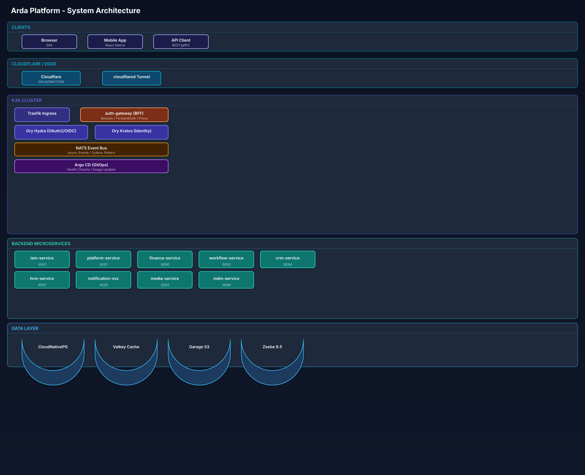
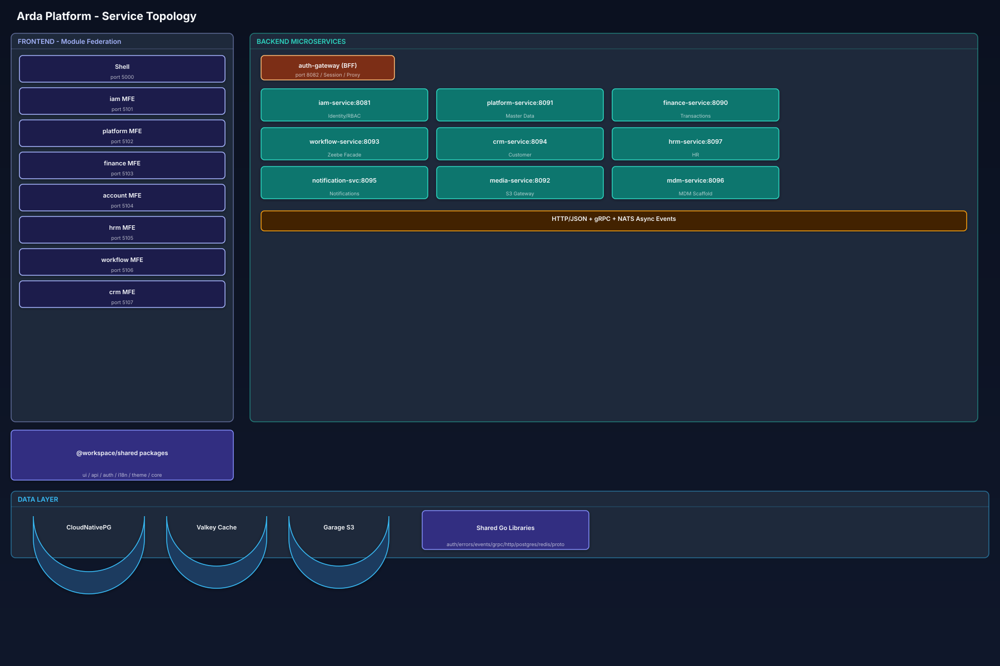
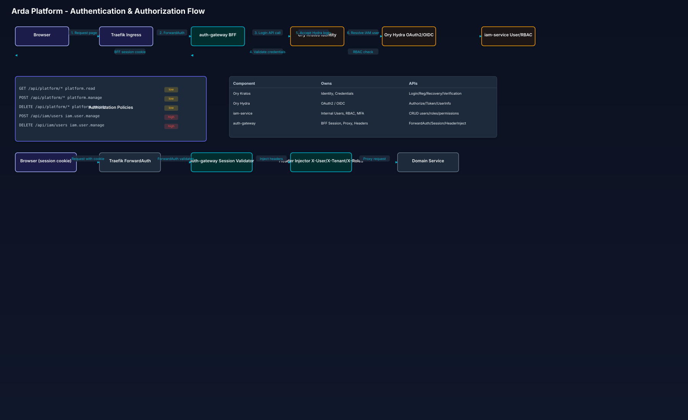
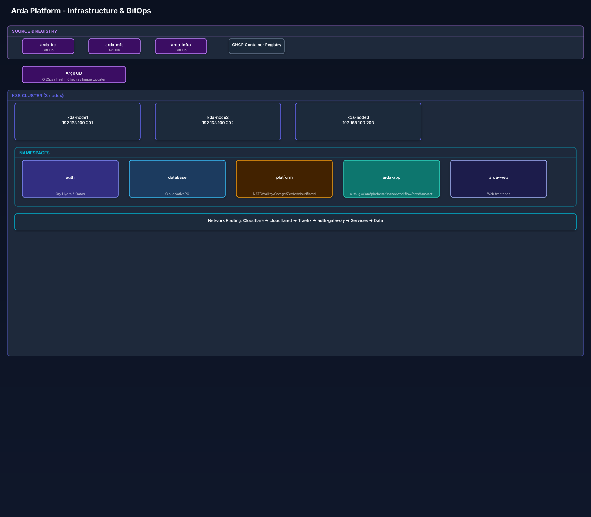

# Arda Labs

> Where data flows with intelligence.

**Arda Labs** builds a cloud-native, multi-tenant financial operations platform. The system is organized as independent Git repositories: backend Go microservices, a frontend React Module Federation shell, and GitOps-managed Kubernetes infrastructure.

---

## System Architecture Overview



> 📐 [Open in draw.io](./assets/system-architecture.drawio) to edit

---

## Service Topology & Communication



> 📐 [Open in draw.io](./assets/service-topology.drawio) to edit

---

## Authentication & Authorization Flow



> 📐 [Open in draw.io](./assets/auth-flow.drawio) to edit

---

## Infrastructure & GitOps



> 📐 [Open in draw.io](./assets/infrastructure.drawio) to edit

---

## Repositories

| Repository | Purpose |
| --- | --- |
| [`arda-be`](https://github.com/arda-labs/arda-be) | Go 1.26 microservices, shared libraries, protobuf definitions, NATS events, Zeebe workers |
| [`arda-mfe`](https://github.com/arda-labs/arda-mfe) | React 19 MFE shell + 7 remotes via Module Federation (Vite 8, Bun) |
| [`arda-infra`](https://github.com/arda-labs/arda-infra) | K3s manifests, Argo CD applications, Traefik config, Ory auth, CloudNativePG |
| [`.github`](https://github.com/arda-labs/.github) | Organization profile and GitHub metadata |

## Platform Components

### Frontend Modules

| Module | Port | Description |
| --- | --- | --- |
| `shell` | 5000 | Layout, auth bootstrap, navigation, lazy remote loading |
| `mfe-iam` | 5101 | Identity & access admin — users, groups, roles, permissions |
| `mfe-platform` | 5102 | Master data & platform admin — organizations, lookups |
| `mfe-finance` | 5103 | Finance operations — accounts, transactions, approvals |
| `mfe-account` | 5104 | Profile & account settings — security, sessions, devices |
| `mfe-hrm` | 5105 | HRM admin — positions, employees, org units |
| `mfe-workflow` | 5106 | BPMN workflow admin — case types, process config, modeler |
| `mfe-crm` | 5107 | CRM & workbench — customers, transaction ops |

### Backend Services

| Service | Port | DB | Description |
| --- | --- | --- | --- |
| `auth-gateway` | 8082 | — | API gateway, OAuth/OIDC proxy, forward-auth, BFF session |
| `iam-service` | 8081 | `iam` | Identity, RBAC (Casbin), MFA, audit |
| `platform-service` | 8091 | `common` | Reference data, lookups, organizations, geography |
| `finance-service` | 8090 | `finance` | Accounts, transactions, approvals |
| `workflow-service` | 8093 | `workflow` | Zeebe facade, BPMN, cases |
| `crm-service` | 8094 | `crm` | Customer management, amendments |
| `hrm-service` | 8097 | `hrm` | Positions, employees, registrations |
| `notification-service` | 8095 | `notification` | Notifications, Web Push, NATS outbox |
| `media-service` | 8092 | `media` | S3 storage (Garage) |
| `mdm-service` | 8096 | — | Master Data Management *(scaffold)* |

## Tech Stack

| Layer | Technology |
| --- | --- |
| **Frontend** | React 19, TypeScript 6, Vite 8, Module Federation, Tailwind CSS 4, shadcn/ui, TanStack Query, Zustand, RHF + Zod, i18next |
| **Backend** | Go 1.26, `net/http` (stdlib), gRPC, protobuf, PostgreSQL 18, goose, Casbin, NATS JetStream |
| **Auth** | Ory Hydra (OAuth2/OIDC) + Ory Kratos (identity/password), auth-gateway (BFF) |
| **Storage** | CloudNativePG (PostgreSQL 18, 3-node HA), Valkey (3-node), Garage S3 (3-node) |
| **Gateway** | Traefik with forward-auth, auth-gateway |
| **GitOps** | Argo CD, Kustomize, Image Updater |
| **Runtime** | K3s cluster (3 HA nodes), Cloudflare Tunnel, GHCR |
| **Workflow** | Zeebe 8.5, BPMN 2.0, job workers |
| **Events** | NATS JetStream, transactional outbox, `ardaevents.Envelope` |

## API Routing

```
Internet → Cloudflare → arda.io.vn
  /api/*      → Traefik → auth-gateway (forward-auth) → domain services
  /assets/*, /mfes/* → web (MFE shell)
  catch-all   → web (MFE shell SPA)
```

## Event System (NATS)

**Subject:** `arda.<domain>.<aggregate>.<action>.v1`
**Envelope:** `ardaevents.Envelope[T]` with id, event_code, schema_version, occurred_at, source_service, tenant_id, actor, payload.

| Event | Description |
| --- | --- |
| `iam.user.created` | New user registered |
| `iam.permission.changed` | Permissions updated |
| `finance.transaction.posted` | Transaction recorded |
| `finance.approval.requested` | Approval needed |
| `workflow.task.created` | BPMN task created |

## Brand

| Attribute | Value |
| --- | --- |
| **Name** | ARDA Labs |
| **Fonts** | Space Grotesk (logo), Inter (text) |
| **Colors** | Cyan `#06B6D4`, Indigo `#6366F1`, Midnight `#0F172A` |
| **Style** | Minimal, data-oriented, operational |
| **Slogan** | *Where data flows with intelligence.* |

## Links

- Website: [arda.io.vn](https://arda.io.vn)
- Contact: contact@arda.io.vn
