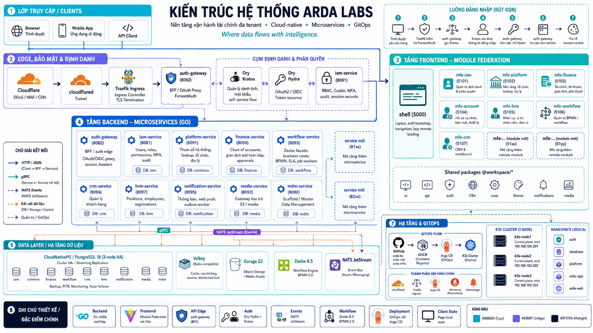

# Arda Labs

> Where data flows with intelligence.

**Arda Labs** builds a cloud-native, multi-tenant financial operations platform. The system is organized as three independent Git repositories: backend Go microservices (`arda-be`), a frontend React Module Federation shell (`arda-mfe`), and GitOps-managed Kubernetes infrastructure (`arda-infra`).

<p align="center">
  
</p>

---

## Architecture Overview

Arda follows a **layered microservices architecture** running on a 3-node K3s cluster:

```
Browser / Mobile App / API Client
         │
    ┌────▼─────────────────────────┐
    │   Cloudflare (DDoS/WAF/CDN)  │
    │   cloudflared Tunnel         │
    └────┬─────────────────────────┘
         │
    ┌────▼─────────────────────────┐
    │   Traefik Ingress            │
    │   auth-gateway (BFF)         │  ← ForwardAuth, OAuth/OIDC, Session
    │   Ory Hydra + Ory Kratos     │  ← Identity & Authorization
    └────┬─────────────────────────┘
         │
    ┌────▼─────────────────────────┐
    │   Backend Microservices      │  ← HTTP/JSON + gRPC + NATS Events
    │   (9 services)               │
    └────┬─────────────────────────┘
         │
    ┌────▼─────────────────────────┐
    │   Data Layer                 │
    │   CloudNativePG · Valkey     │
    │   Garage S3 · Zeebe 8.5      │
    └──────────────────────────────┘
```

### Key Design Decisions

| Decision | Choice | Rationale |
| --- | --- | --- |
| **Backend framework** | Go `net/http` stdlib | No external web framework; explicit routing via `http.NewServeMux` |
| **Frontend architecture** | Module Federation (Vite 8) | Independent deployability per domain; shared packages via `@workspace/*` |
| **API edge** | auth-gateway (BFF) | Single OAuth/OIDC proxy; forward-auth; header injection; no direct browser-to-service calls |
| **Auth** | Ory Hydra + Kratos | Hydra owns OAuth2/OIDC; Kratos owns identity/password; IAM owns RBAC & audit |
| **Events** | NATS JetStream | Async domain events via transactional outbox; envelope `ardaevents.Envelope[T]` |
| **Workflow** | Zeebe 8.5 | BPMN 2.0 execution; `workflow-service` as sole Zeebe facade |
| **Storage** | CloudNativePG | PostgreSQL 18 with 3-node HA; automated failover via CNPG operator |
| **Deployment** | GitOps (Argo CD) | Desired state in `arda-infra`; auto-sync + image updater |
| **Client state** | Page-local | No TanStack Query; `useState` + `useEffect` + `useCallback` directly in pages |

---

## Service Topology & Communication

### Frontend — Module Federation (7 remotes + shell)

| Module | Port | Responsibility |
| --- | --- | --- |
| `shell` | 5000 | Layout, auth bootstrap, navigation, lazy remote loading |
| `mfe-iam` | 5101 | Identity & access admin — users, groups, roles, permissions |
| `mfe-platform` | 5102 | Master data & platform admin — organizations, lookups, geography |
| `mfe-finance` | 5103 | Finance operations — accounts, transactions, approvals |
| `mfe-account` | 5104 | Profile & account settings — security, sessions, devices |
| `mfe-hrm` | 5105 | HRM admin — positions, employees, org units, registrations |
| `mfe-workflow` | 5106 | BPMN workflow admin — case types, process config, modeler |
| `mfe-crm` | 5107 | CRM & workbench — customers, transaction operations |

**Shared packages (`@workspace/*`):** `ui` (shadcn components), `api` (HTTP client), `auth` (session/step-up), `i18n` (locales), `core` (list API helpers, routing), `theme` (tokens), `notifications`, `media`.

### Backend — 9 Go Microservices

All services share common libraries from `libs/go/`: `arda-auth`, `arda-errors`, `arda-events`, `arda-grpc`, `arda-proto`, `arda-postgres`, `arda-redis`.

| Service | Port | Database | Responsibility |
| --- | --- | --- | --- |
| `auth-gateway` | 8082 | — | BFF/auth edge, OAuth/OIDC proxy, forward-auth, session, header injection |
| `iam-service` | 8081 | `iam` | Users, roles (Casbin), permissions, MFA, audit, login orchestration |
| `platform-service` | 8091 | `common` | System parameters, lookups, organizations, geography, credit institutions |
| `finance-service` | 8090 | `finance` | Chart of accounts, double-entry transactions, approvals, operation queues |
| `workflow-service` | 8093 | `workflow` | Zeebe facade, business cases, BPMN process definitions, SLA, job workers |
| `crm-service` | 8094 | `crm` | Customer management, amendments |
| `hrm-service` | 8097 | `hrm` | Positions, employees, registrations |
| `notification-service` | 8095 | `notification` | Notifications, Web Push, NATS outbox worker |
| `media-service` | 8092 | `media` | S3 storage gateway (Garage) |
| `mdm-service` | 8096 | — | Master Data Management *(scaffold)* |

**Service-to-service communication:**
- **HTTP/JSON** via auth-gateway for browser-facing APIs
- **gRPC** for internal service calls (platform reference data, workflow commands)
- **NATS** for async domain events (notifications, audit, cache invalidation)

---

## Authentication & Authorization Flow

### Identity Architecture

Arda uses a **four-component auth model**:

| Component | Owns |
| --- | --- |
| **Ory Kratos** | Identity traits, password credentials, self-service flows |
| **Ory Hydra** | OAuth2/OIDC challenges, consent, token issuance |
| **iam-service** | Internal users, RBAC (Casbin policies), MFA, audit, session records |
| **auth-gateway** | BFF session, Kratos/Hydra proxy, header injection, `/api/auth/*` |

### Login Flow (step by step)

```
1. Browser → Traefik Ingress (request page)
2. Traefik → auth-gateway (ForwardAuth check)
3. auth-gateway → Ory Kratos (login API call)
4. Kratos validates credentials → auth-gateway
5. auth-gateway → Ory Hydra (accept login challenge)
6. auth-gateway → iam-service (resolve IAM user by Kratos identity)
7. auth-gateway → Browser (BFF session cookie)
```

**Key rules:**
- Frontend never calls Kratos/Hydra directly — always through auth-gateway proxy
- Canonical business user key is always `iam_users.id` (UUID)
- Protected downstream services receive `X-User-Id`, `X-Tenant-Id`, `X-Roles`, `X-Permissions` headers from auth-gateway

### Authorization Policies

Route-level permissions enforced via `auth-gateway/configs/policy.yaml`:

| Route Pattern | Required Permission | Risk |
| --- | --- | --- |
| `GET /api/platform/*` | `platform.read` | low |
| `POST /api/platform/*` | `platform.manage` | low |
| `DELETE /api/platform/*` | `platform.manage` | low |
| `POST /api/iam/users` | `iam.user.manage` | high |
| `DELETE /api/iam/users` | `iam.user.manage` | high |

---

## Infrastructure & GitOps

### Cluster Topology

| Node | IP | Role |
| --- | --- | --- |
| `k3s-node1` | `192.168.100.201` | control-plane, etcd |
| `k3s-node2` | `192.168.100.202` | control-plane, etcd |
| `k3s-node3` | `192.168.100.203` | control-plane, etcd |

Runtime: K3s `v1.35.5+k3s1`, Traefik ingress, Cloudflare Tunnel (`arda.io.vn`).

### Namespaces

| Namespace | Contents |
| --- | --- |
| `auth` | Ory Hydra, Ory Kratos |
| `database` | CloudNativePG PostgreSQL cluster (3-node HA) |
| `platform` | NATS (3-node), Valkey (3-node), Garage S3 (3-node), Zeebe 8.5, cloudflared |
| `arda-app` | All backend microservices + auth-gateway |
| `arda-web` | MFE shell and static assets |

### GitOps Pipeline

```
GitHub (arda-be / arda-mfe / arda-infra)
    → GHCR (container registry)
    → Argo CD (auto-sync + image updater)
    → K3s cluster
```

- **Argo CD manages:** `database/`, `k8s/` (backend + frontend manifests)
- **Manual bootstrap:** `auth/setup.sh`, `platform/bootstrap/*`

### Network Routing

```
Cloudflare Tunnel (arda.io.vn)
    /api/* → auth-gateway → domain services
    /assets/*, /mfes/* → web (MFE shell)
    catch-all → web (MFE shell SPA)
```

### Dev Environment

| Resource | Access |
| --- | --- |
| PostgreSQL | NodePort `30432` |
| Valkey | NodePort `30379` |
| NATS | `kubectl port-forward svc/nats 4222:4222` |
| Hydra admin | NodePort `30445` |
| Kratos admin | NodePort `30446` |

---

## Tech Stack

| Layer | Technology |
| --- | --- |
| **Frontend** | React 19, TypeScript 6, Vite 8, Module Federation, Tailwind CSS 4, shadcn/ui, Zustand, React Hook Form + Zod, i18next |
| **Backend** | Go 1.26, `net/http` (stdlib), gRPC, protobuf, PostgreSQL 18, goose migrations, Casbin RBAC, NATS JetStream |
| **Auth** | Ory Hydra (OAuth2/OIDC) + Ory Kratos (identity), auth-gateway (BFF with forward-auth) |
| **Storage** | CloudNativePG (PostgreSQL 18, 3-node HA), Valkey (3-node cluster), Garage S3 (3-node) |
| **Gateway** | Traefik with forward-auth, auth-gateway proxy |
| **GitOps** | Argo CD, Kustomize, Image Updater |
| **Runtime** | K3s (3 HA nodes), Cloudflare Tunnel, GHCR container registry |
| **Workflow** | Zeebe 8.5 + BPMN 2.0, `bpmn-js` modeler in shell |
| **Events** | NATS JetStream, transactional outbox pattern, `ardaevents.Envelope[T]` |

---

## HTTP API Contract

All domain services follow a **unified REST contract** through auth-gateway:

### List Response (paginated)

```json
{
  "items": [...],
  "page": 1,
  "per_page": 20,
  "total": 1234
}
```

### Error Response (arda-errors)

```json
{
  "error": {
    "code": "validation.invalid_input",
    "message": "Request is invalid",
    "fields": { "email": "validation.required" },
    "request_id": "correlation-id"
  }
}
```

**Common error codes:** `auth.error.unauthorized` (401), `auth.error.forbidden` (403), `common.error.not_found` (404), `common.error.conflict` (409), `validation.invalid_input` (400), `common.error.internal` (500).

**Correlation:** Every response includes `X-Request-Id` header. Frontend `ApiClientError` exposes `code`, `message`, `status`, `fields`, `requestId`. Translation via `translateApiError()` at `@workspace/i18n`.

---

## Event System (NATS)

**Subject pattern:** `arda.<domain>.<aggregate>.<action>.v1`
**Event code pattern:** `<domain>.<aggregate>.<action>`

### Envelope (`ardaevents.Envelope[T]`)

```json
{
  "id": "uuid",
  "event_code": "notification.inbox.created",
  "schema_version": 1,
  "occurred_at": "2026-07-04T12:00:00Z",
  "source_service": "notification-service",
  "tenant_id": "uuid",
  "actor": { "user_id": "uuid" },
  "payload": { }
}
```

### Published Events

| Event | Description |
| --- | --- |
| `iam.user.created` | New user registered |
| `iam.permission.changed` | Permissions updated (triggers cache invalidation) |
| `finance.transaction.posted` | Transaction recorded |
| `finance.approval.requested` | Approval needed |
| `workflow.task.created` | BPMN task created |

**Publish patterns:**
- **Transactional outbox** (preferred) — insert outbox row in same DB transaction as business write; background worker publishes to NATS
- **Direct publish** — only when loss acceptable

Consumers must be **idempotent** (at-least-once delivery). Use `schema_version` for payload evolution.

---

## Workflow Engine (Zeebe 8.5 + BPMN 2.0)

### Boundary Rule

```
Only workflow-service talks to Zeebe.
Domain services → workflow-service via gRPC (CreateCase / SubmitCase).
MFE → workflow-service via HTTP /api/workflow/* (through auth-gateway).
```

### Integration Pattern

When a domain action starts an approval flow:

1. Persist domain record (draft) in domain service
2. Call `workflowClient.CreateCase()` with `CaseType`, `PrimaryObjectID`, `DomainService`
3. Call `workflowClient.SubmitCase(caseID, actor, variables)` — starts Zeebe process instance
4. Store `workflow_case_id` on domain row

### BPMN Modeling Contract

| Element | Type | Details |
| --- | --- | --- |
| Human step | `bpmn:userTask` | `zeebe:userTask` + `assignmentDefinition` — never `serviceTask` |
| Domain side effect | `bpmn:serviceTask` | Job type `{service}.{aggregate}.{op}.{action}`, explicit retries |
| Business failure | Worker `ThrowError` | Error boundary event (not gateway flags) |
| Notification | NATS outbox | After domain commit — never blocking task before End |
| Variables | References only | `caseId`, `primaryObjectId`, `approvalResult` — no PII/blobs |
| SLA | Non-interrupting timer boundary | Per user task; user tasks never fail on timeout |

**UI:** `bpmn-js` NavigatedViewer + Modeler in `apps/workflow`. Zeebe extensions via `zeebe-bpmn-moddle`. Deploy flow: save XML → `POST .../process-definitions` → `.../deploy`.

---

## Frontend Architecture (arda-mfe)

### State Boundaries

| Kind | Tool |
| --- | --- |
| Server state (API) | Page-local state (`useState` + `useEffect` + `useCallback`) |
| Form state | React Hook Form + Zod schemas |
| Client/session | Zustand (`@workspace/auth`, notifications, preferences) |
| URL filters | `nuqs` or `useSearchParams` |

### Feature Folder Convention

```
apps/<remote>/src/features/<domain>/
  api.ts                    # domain types + API methods
  <entity>/
    page.tsx                # ≤ 400 lines; split into components/ when exceeded
    schemas.ts              # Zod schemas + defaultValues
    components/             # UI components (when page > ~200 lines)
    utils/                  # helpers, mappers, constants
```

### UI Archetypes

| Type | Title Component | Scroll | Pagination |
| --- | --- | --- | --- |
| **List** (CRUD tables) | `PageHeader` (fixed) | Table body only | Fixed in panel border |
| **Workspace** (forms, wizards) | `PageTitle` (collapsible) | Content area | Footer submit bar |

### UI Conventions

- All admin lists use `DataTable` + toolbar (filter, column toggle, density, pagination)
- Semantic colors via `Status` / `Badge` variants — never raw Tailwind colors
- Every user-visible string through `t()` i18n — `vi-VN` + `en-US` pairs
- Heavy widgets (BPMN, charts) lazy-loaded at usage site
- Shell provides `ShellLayout`; remotes expose only `./Routes`

---

## Backend Conventions (arda-be)

### Service Layering

```
apps/<service>/
  cmd/<service>/main.go
  internal/
    config/
    domain/
    repository/
    service/
    transport/http/router.go
  migrations/*.sql          # goose embedded
```

### DO

- Map domain errors through `arda-errors` envelope
- Protected APIs → policy entry + header validation
- Health endpoints: `/health/live`, `/health/ready`
- `slog` JSON structured logging
- Explicit service routing in auth-gateway

### DON'T

- Import cross-service domain logic — use HTTP/gRPC or NATS events
- Hardcode secrets — read from environment/Secrets
- Skip migrations when changing schema

---

## Repositories

| Repository | Purpose |
| --- | --- |
| [`arda-be`](https://github.com/arda-labs/arda-be) | Go 1.26 microservices workspace — 9 services, shared libs, protobuf, NATS events, Zeebe workers |
| [`arda-mfe`](https://github.com/arda-labs/arda-mfe) | Bun + Vite 8 + React 19 MFE — shell + 7 remotes via Module Federation |
| [`arda-infra`](https://github.com/arda-labs/arda-infra) | K3s manifests, Argo CD applications, Traefik config, Ory auth, CloudNativePG |
| [`.github`](https://github.com/arda-labs/.github) | Organization profile and GitHub metadata |

---

## Brand

| Attribute | Value |
| --- | --- |
| **Name** | ARDA Labs |
| **Fonts** | Space Grotesk (logo), Inter (text) |
| **Colors** | Cyan `#06B6D4`, Indigo `#6366F1`, Midnight `#0F172A` |
| **Style** | Minimal, data-oriented, operational |
| **Slogan** | *Where data flows with intelligence.* |

---

## Links

- Website: [arda.io.vn](https://arda.io.vn)
- Contact: contact@arda.io.vn
